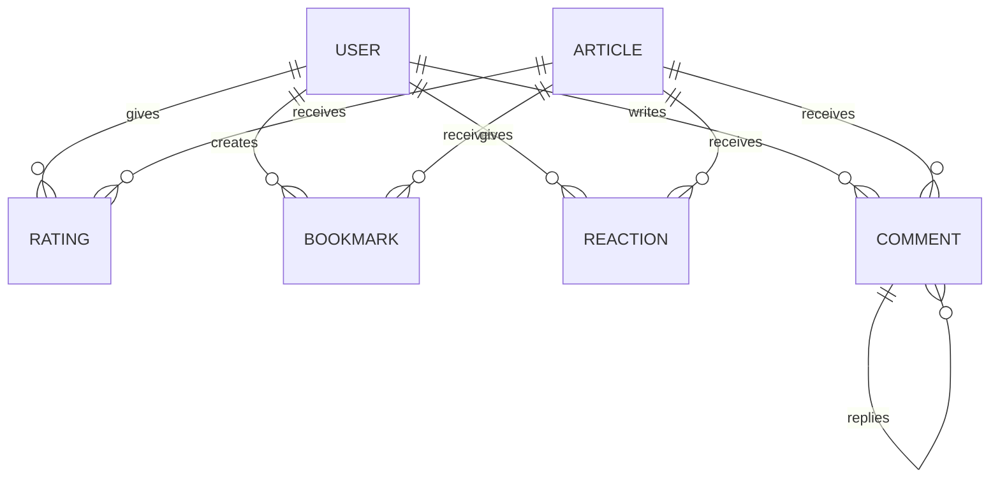

# 社交互动功能模块

这个模块实现了博客系统的社交互动功能，包括评价、收藏、反应和评论系统。

## 功能概述

### 1. 评价系统 (Rating)
- 用户可以对文章进行1-5星评分
- 计算文章的平均评分
- 查看用户的所有评分

### 2. 收藏系统 (Bookmark)
- 用户可以收藏喜欢的文章
- 取消收藏
- 查看用户的所有收藏

### 3. 反应系统 (Reaction)
- 用户可以对文章点赞或点踩
- 切换反应类型
- 统计文章的点赞和点踩数

### 4. 评论系统 (Comment)
- 用户可以对文章发表评论
- 支持评论回复（嵌套评论）
- 编辑和删除自己的评论

## 实体关系

## API 接口

### 评价接口
- `POST /ratings` - 创建/更新评分
- `GET /ratings/article/:articleId` - 获取文章平均评分
- `GET /ratings/user/:userId` - 获取用户的所有评分
- `GET /ratings/user/article/:articleId` - 获取用户对特定文章的评分

### 收藏接口
- `POST /bookmarks` - 创建收藏
- `DELETE /bookmarks/:articleId` - 取消收藏
- `GET /bookmarks` - 获取用户的所有收藏
- `GET /bookmarks/:articleId` - 检查文章是否已收藏

### 反应接口
- `POST /reactions` - 创建/更新反应
- `POST /reactions/toggle/:articleId/:type` - 切换反应类型
- `DELETE /reactions/:articleId` - 删除反应
- `GET /reactions/article/:articleId` - 获取文章的反应统计
- `GET /reactions/user/:articleId` - 获取用户对文章的反应

### 评论接口
- `POST /comments` - 创建评论
- `GET /comments/article/:articleId` - 获取文章的所有顶级评论
- `GET /comments/replies/:commentId` - 获取评论的回复
- `PUT /comments/:id` - 更新评论
- `DELETE /comments/:id` - 删除评论
- `GET /comments/:id` - 获取特定评论

## 使用方法

1. 确保已在 `app.module.ts` 中导入了 `SocialModule`
2. 所有接口都需要 JWT 认证
3. 通过相应的 DTO 来传递参数

## 数据库表

模块会自动创建以下表：
- `ratings` - 存储用户对文章的评分
- `bookmarks` - 存储用户的收藏
- `reactions` - 存储用户的反应（点赞/点踩）
- `comments` - 存储文章评论和回复